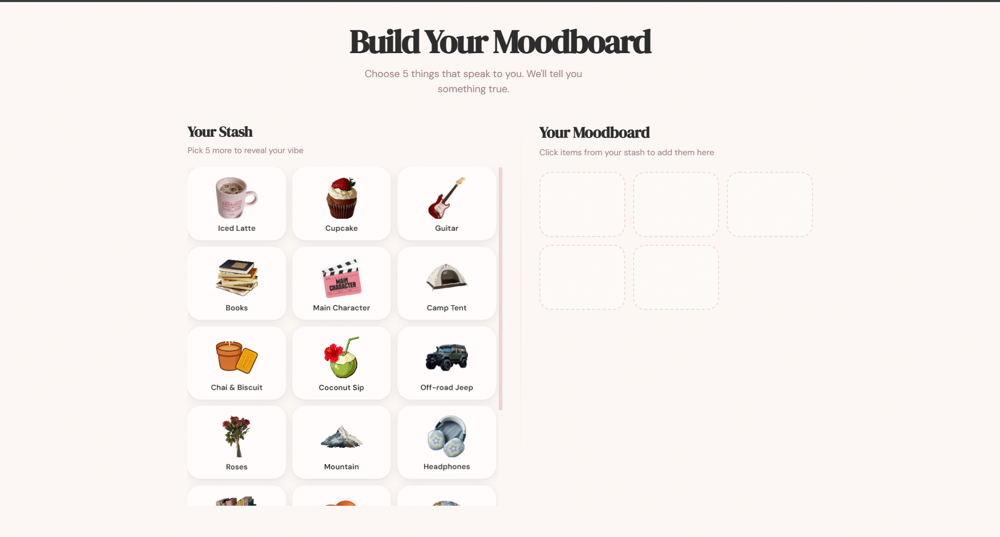
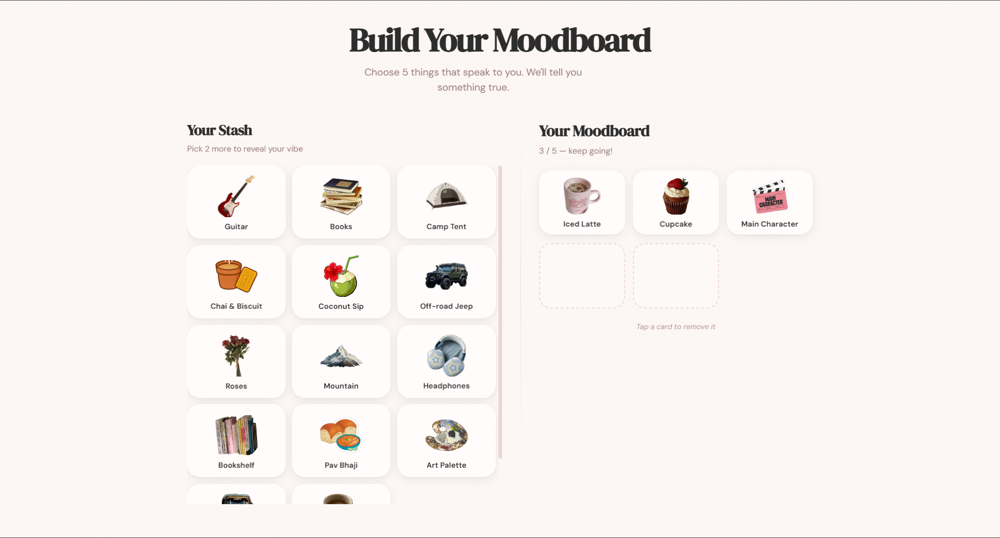
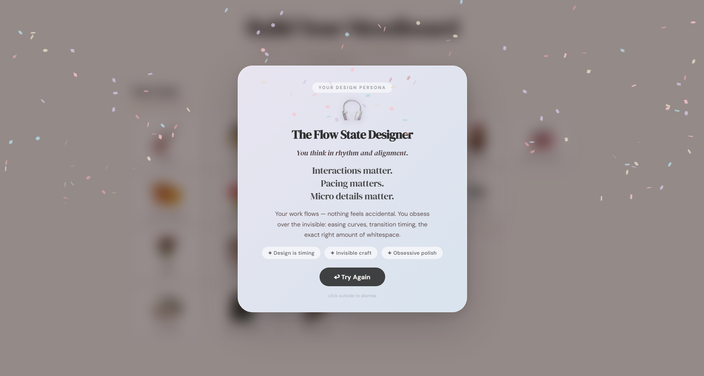

# Moodboard Builder

An interactive "Build a Moodboard" experience for portfolio websites. Users select five visual elements from a curated stash, and the application analyzes their choices to reveal a personalized design persona.

---

## Overview

The experience is built around a two-pane layout: a scrollable stash of visual sticker cards on the left, and a five-slot canvas on the right. Clicking a card moves it from the stash to the canvas using a shared-element layout animation. Once five items are selected, a persona reveal overlay appears automatically.

The project was designed to be embedded directly inside a personal portfolio site as a standalone interactive section.

---

## Screenshots







---

## Tech Stack

| Layer | Technology |
|---|---|
| Framework | React 18 (via Vite) |
| Animations | Framer Motion |
| Confetti | canvas-confetti |
| Styling | Vanilla CSS with custom properties |
| Fonts | DM Serif Display, DM Sans (Google Fonts) |
| Build tool | Vite 7 |

---

## Project Structure

```
src/
    components/
        Moodboard/
            MoodboardGame.jsx       Parent state manager and layout root
            MoodboardGame.css
            ElementStash.jsx        Left pane — scrollable stash grid
            ElementStash.css
            Canvas.jsx              Right pane — five-slot moodboard canvas
            Canvas.css
            ItemCard.jsx            Individual animated image card
            ItemCard.css
            ResultModal.jsx         Persona reveal overlay with confetti
            ResultModal.css
    data/
        moodboardData.js            Static element definitions and persona objects
    utils/
        calculateVibe.js            Priority-ordered scoring function
public/
    icons/                          17 PNG sticker images (transparent background)
```

---

## How It Works

### Interaction Model

There is no drag-and-drop. Clicking a card in the stash removes it from the stash array and appends it to the canvas array. Framer Motion's `layoutId` prop — shared between the stash and canvas instances of the same card — produces a smooth shared-element transition between the two positions. A single `LayoutGroup` wraps both panes so Framer Motion can coordinate the animation.

Clicking a card that is already on the canvas returns it to the stash, also animated.

Once the canvas holds five items, a 600 ms delay fires (to let the final card land), and then the `ResultModal` opens automatically.

### Scoring System

Each element carries a `tags` array with one or more of the following dimensions:

| Dimension | Description |
|---|---|
| `cozy` | Comfort-oriented, warm, domestic |
| `structured` | Systematic, orderly, logic-driven |
| `nostalgic` | Cultural memory, local texture |
| `creative` | Expressive, artistic, musical |
| `playful` | Light, fun, visually rich |
| `explorer` | Adventurous, curious, outdoors |

`calculateVibe.js` counts how many selected elements contribute each tag, then walks through eight priority rules in order and returns the first match:

```
1. explorer >= 2                              Indie Explorer
2. cozy >= 3                                  Cozy Product Thinker
3. creative >= 2 AND structured >= 1          Flow State Designer
4. creative >= 2 AND playful >= 1             Moodboard Maximalist
5. nostalgic >= 2                             Nostalgic Modernist
6. playful >= 2 AND structured >= 1           Playful Structured Thinker
7. cozy >= 2 AND structured >= 1              Soft Systems Designer
8. (fallback)                                 Story-Driven Builder
```

Because rules are checked in this exact order, a selection that satisfies multiple conditions always resolves to the highest-priority persona.

### Persona Reveal

Each persona object carries a structured `copy` field:

```js
copy: {
    hook: "Opening line — italic serif, displayed large",
    body: ["Punchy", "stacked", "words"],
    context: "One or two connector sentences in prose.",
    traits: ["Pill one", "Pill two", "Pill three"],
}
```

`ResultModal.jsx` renders these fields as distinct visual layers with staggered entrance animations. A pastel confetti burst fires once when the modal opens, and resets between plays so it fires again after "Try Again".

---

## Element Reference

| Label | Tags |
|---|---|
| Iced Latte | cozy, playful |
| Cupcake | cozy, playful |
| Guitar | creative |
| Books | structured, nostalgic |
| Main Character | creative |
| Camp Tent | explorer |
| Chai and Biscuit | cozy, nostalgic |
| Coconut Sip | playful, cozy |
| Off-road Jeep | explorer |
| Roses | cozy |
| Mountain | explorer |
| Headphones | creative, structured |
| Bookshelf | structured |
| Pav Bhaji | nostalgic |
| Art Palette | creative, playful |
| Auto Rickshaw | nostalgic, explorer |
| Green Tea | cozy, structured |

---

## Persona Reference

| Persona | Primary trigger |
|---|---|
| Indie Explorer | explorer >= 2 |
| Cozy Product Thinker | cozy >= 3 |
| Flow State Designer | creative >= 2, structured >= 1 |
| Moodboard Maximalist | creative >= 2, playful >= 1 |
| Nostalgic Modernist | nostalgic >= 2 |
| Playful Structured Thinker | playful >= 2, structured >= 1 |
| Soft Systems Designer | cozy >= 2, structured >= 1 |
| Story-Driven Builder | fallback |

---

## Getting Started

**Prerequisites:** Node.js 18 or later.

```bash
# Install dependencies
npm install

# Start the development server
npm run dev

# Production build
npm run build
```

The dev server runs at `http://localhost:5173`.

---

## Adding Elements

1. Drop a PNG (transparent background recommended) into `public/icons/`.
2. Add a new entry to the `ELEMENTS` array in `src/data/moodboardData.js`:

```js
{
    id: "unique_id",
    label: "Display Name",
    image: "/icons/your-file.png",
    tags: ["cozy", "structured"],   // one or more dimensions
    alt: "Accessible description",
}
```

No other files need to change. The scoring logic reads tags dynamically.

---

## Extending Personas

To add a new persona:

1. Add a result object to the `RESULTS` array in `src/data/moodboardData.js`.
2. Add a new priority rule in `src/utils/calculateVibe.js` at the appropriate position in the rule chain.
3. The `ResultModal` component renders any persona that follows the `{ id, title, emoji, gradient, copy }` shape — no changes needed there.

---

## Performance Notes

- Framer Motion `variants` objects are defined outside components to prevent redefinition on each render.
- `useCallback` is applied to all event handlers in `MoodboardGame` to prevent unnecessary child re-renders during layout animations.
- Card images use `loading="lazy"` and `will-change: transform` with `translateZ(0)` to keep the browser on the GPU compositing path during animations.
- The grain texture overlay uses a CSS SVG data URI rather than a separate image request and is excluded from GPU compositing layers.

---

## Collaborators

- [voxovoxo](https://github.com/voxovoxo)

---

## License

MIT
